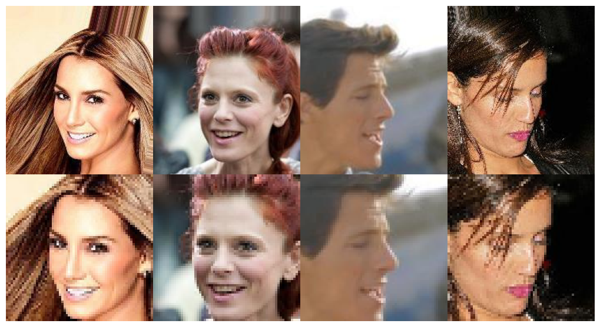
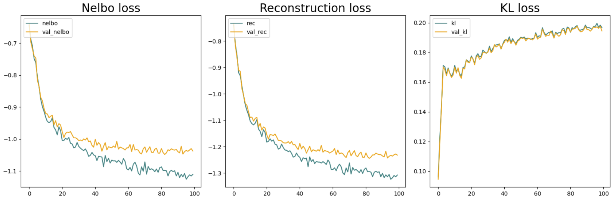

 <h1> VAE_celeba </h1> 

<a>Jovana&nbsp;Gentić 🦆</a>

<a href="https://www.kaggle.com/code/jovanagenti/tensorflow-vae-celeba">tensorflow notebook</a>

<a href="https://www.kaggle.com/code/jovanagenti/jax-vae-celeba">jax notebook</a>

<a href="https://www.kaggle.com/jovanagenti/pytorch-vae-celeba">pytorch notebook</a>

 
 

In this notebook, we implemented a VAE where both the encoder and decoder model gaussian distributions. The model is trained on CelebA_10 64x64 images.
Model is trained in tensorflow and supports multi-GPU. We created jax and pytorch versions of code for learning purposes.

<strong>Images before and after cropping and resizing for model training</strong>

# About the model #
Encoder is made of convolutions that downsample the image resolution until a certain point, after which we flatten the image
and use a stack of dense layers to get the posterior distribution q(z|x).

Decoder starts off with dense layers to process the sample z,
followed by an unflatten (reshape) operation into an activation of shape (B, h, w, C).
The activation is then upsampled back to the original image size using a stack
of resize-conv blocks. Resize-conv block is a simple nearest neighbord upsampling + convolutions, used to upsample images instead of deconvolution layers.
This block is useful to avoid checkerboard artifacts: https://distill.pub/2016/deconv-checkerboard/

For the Loss, we use the `Negative ELBO = -likelihood + KL_div`.

- `likelihood = decoder_dist.log_pdf(targets)`
- `KL_div = KL(posterior_dist || prior_dist)`
- The `posterior_dist` is the encoder distribution.
- For simplicity, we set the prior distribution to be a simple standard Gaussian `N(0, 1)`.

To help the model avoid a posterior collapse, we warmup the `KL_div` by linearly scaling it up over 10000 steps.

# Generate #
Pick encoder distribution temperature (z_temp) and decoder distribution temperature (x_temp) to generate from the prior,
`pictures = model.generate(z_temp=1., x_temp=0.3)`

